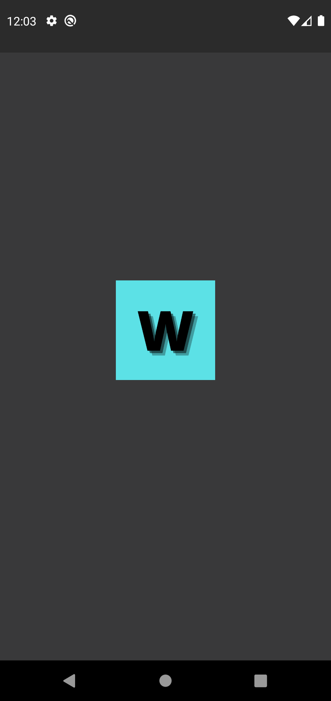
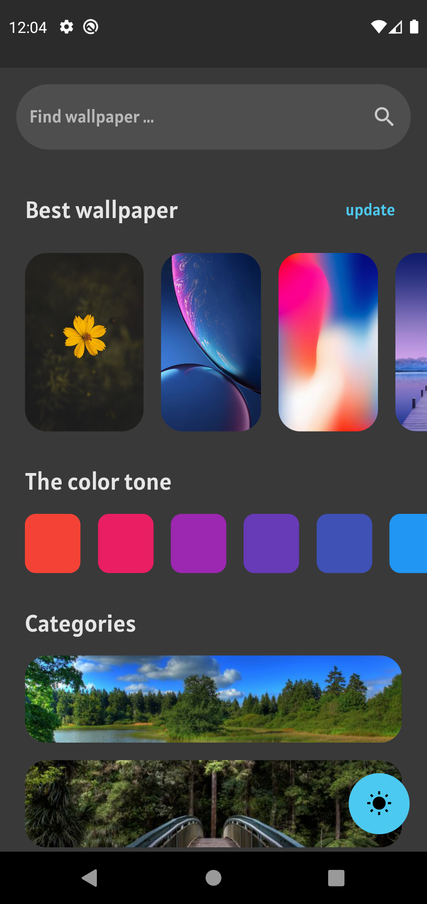
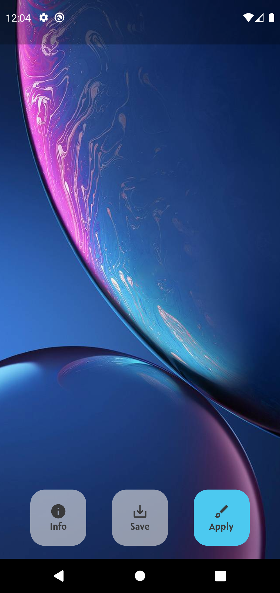
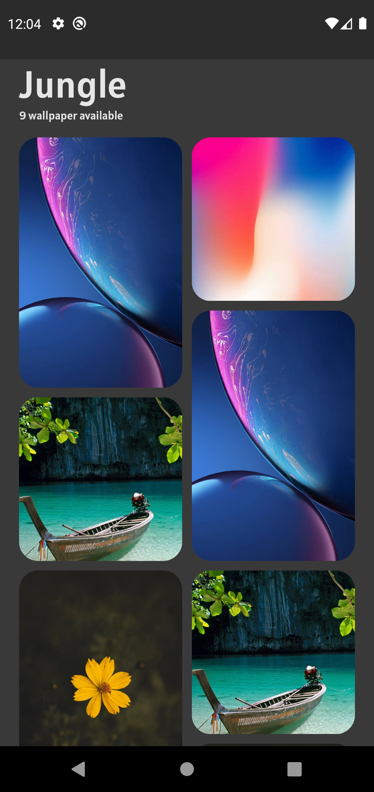
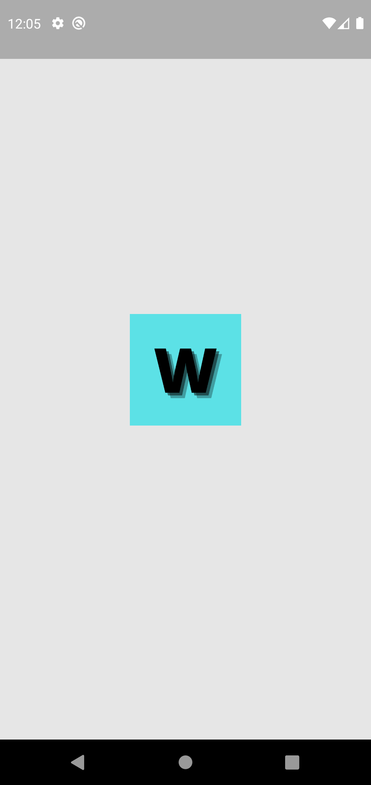
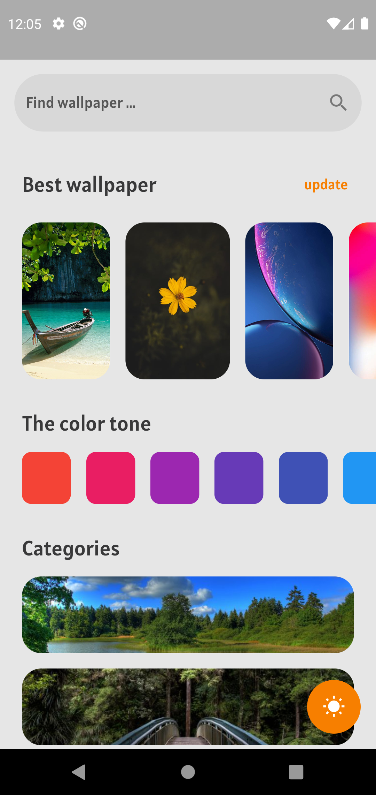
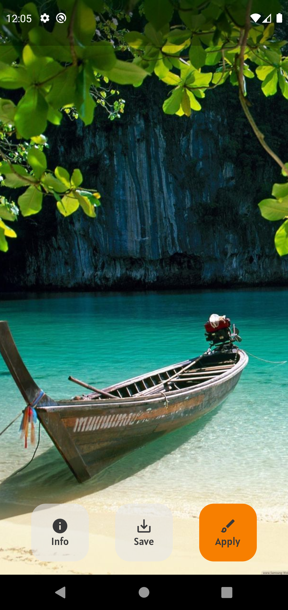
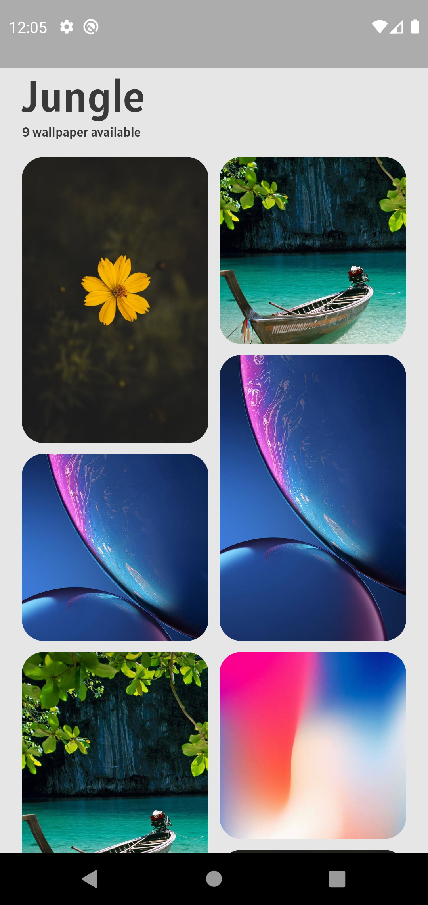

# Fake Wallpaper
###### _MVC flutter app with fake data_

In this sample use mvc for application architecture and use getx package for state management and navigation. data is fake but in future application will be integrate with wallpaper api.

- Feel free to contribute 🙏
- Your pull requests are welcome 🥳

### Screenshots

     

### application detail :

- State Management : Get x
- Navigation : Get x
- Applications architecture : MVC

#### Packages
| Packages | pub.dev |
| ------ | ------ |
| Get x | https://pub.dev/packages/get |
| Intent | https://pub.dev/packages/intent |
| flutter staggered grid view | https://pub.dev/packages/flutter_staggered_grid_view |
| google fonts | https://pub.dev/packages/google_fonts |
| flutter icon launcher | https://pub.dev/packages/flutter_launcher_icons |

